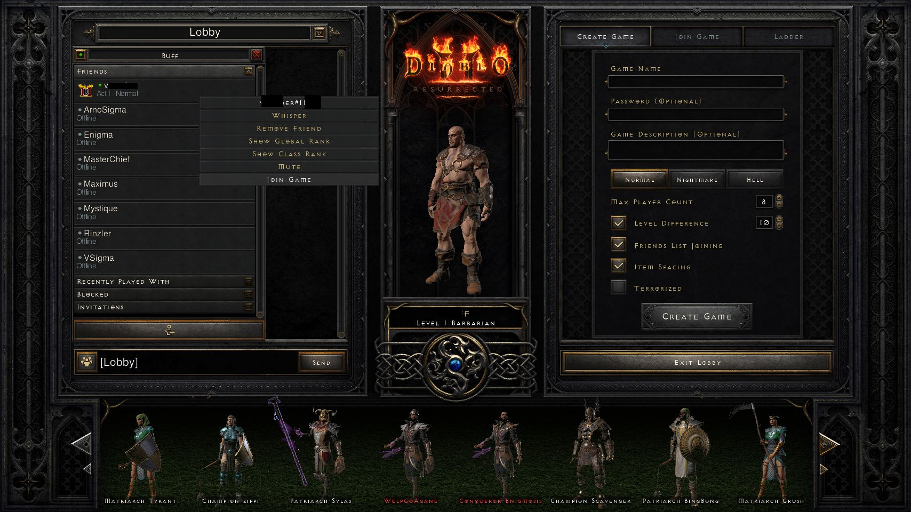

# Friend Selector Design Notes

These notes capture the useful UI structure from private friend-list references without storing real Battle.net tags in the repo.

Do not commit screenshots that show real Battle.net tags. Put private reference captures in `private-captures/`, which is ignored by git, or name them with `.private` / `.sensitive` before the extension.

## Friends Drawer Structure

The lobby friends drawer appears on the left side of the Lobby screen after clicking the party/friends icon beside the chat input.

Observed row patterns:

- Online/joinable friend row: game icon on the left, friend display name on the first line, current location/game state on the second line, for example an act/difficulty label.
- Offline friend row: small status dot/bullet on the left, friend display name on the first line, `Offline` on the second line.
- Group headers: sections such as Friends, Recently Played With, Blocked, and Invitations.

The target row should be identified by configured friend display name plus online/joinable row state, not by a hardcoded personal tag in code or docs.

## Context Menu Structure

Right-clicking a joinable online friend opens a context menu. The captured safe reference is:



Expected joinable menu items include:

- Whisper
- Remove Friend
- Rank options
- Mute
- Join Game

`Join Game` appears as the bottom option in the current reference capture.

### The menu height is not fixed

A friend with no joinable game gets a shorter menu: no name header and no `Join Game` row. Compare
`lobby_right_click_friend_join_game_available.png` against
`lobby_right_click_friend_nojoin_game_available.png` - the joinable menu ends around `y=255`, the
non-joinable one around `y=246`.

This matters because `friendContextJoinGame` is a *predicted* point, not an observed one: the row's
own position plus a fixed offset measured once for row 1. When the menu is shorter than the offset
assumes, or does not open at all, that prediction points at whatever the Friends pane draws
underneath, and the click lands there instead.

At the shipped geometry, row 7 predicts `(0.278, 0.638)` = `(380, 490)`, which is inside the **Add
Friend** button (`y` roughly 478-526). That is where the stray "Enter e-mail address or BattleTag"
modal in `lobby_stray_add_friend_modal.png` came from. The modal then blocks every subsequent
click, so the cost of guessing wrong is a client stuck until someone dismisses it by hand.

`FriendContextMenuProbe` closes this: the agent samples the predicted point before and after the
right-click and only clicks when the pixels demonstrably changed, which is the signature of an
overlay having opened there. A differential test is used rather than a fingerprint of the menu
because the menu's art is exactly the kind of thing an expansion re-skins, while "something
appeared where there was nothing" stays true regardless. It also covers a menu that opens upward
near the bottom of the pane: the predicted point does not change, the probe refuses, and the client
reports it rather than clicking something arbitrary.

> Both right-click reference captures predate Reign of the Warlock and show a menu one row shorter
> than today's - measured at the `y=264` config offset, both are already below their own menus.
> The shipped `0.344` was re-measured for the current menu; do not "correct" it against these two
> captures. They remain valid for menu *structure* and for the joinable/non-joinable height
> difference, which is what the probe tests use them for.

## Assisted Selection Plan

The implemented selector is driven by visible row number and config, not by checked-in personal identifiers:

```json
{
  "ui": {
    "defaultFriendRow": 1,
    "friendRowStart": { "x": 0.18, "y": 0.18 },
    "friendRowHeight": 0.049,
    "friendContextJoinGame": { "x": 0.278, "y": 0.344 }
  }
}
```

1366x768 click coordinates:

| Target | Config/helper target | 1366x768 X,Y | Notes |
| --- | --- | --- | --- |
| Open friends drawer | `LobbyPartyIcon` | `131,543` | Icon beside chat input. |
| Right-click friend row 1 | `FriendRowStart` | `246,138` | Row 2 is `246,176`; row 3 is `246,214`. |
| Click context Join Game | `FriendContextJoinGame` | `380,264` | Row-1 reference point. Runtime clicks keep the same in-menu offset from the right-clicked row because the menu opens anchored to the pointer position. |

The full shared coordinate table is [automation-coordinate-catalog.md](automation-coordinate-catalog.md). Runtime code uses `D2RUiCoordinateCatalog.GetFriendRowPoint`, so invalid or missing row config falls back to the default row start/height instead of drifting into stale docs.

Implemented high-level flow:

1. Select the configured character slot.
2. Click Lobby.
3. Click the friends drawer icon.
4. Right-click the configured visible friend row.
5. Click the known `Join Game` context menu point.

The current implementation does not OCR friend names. Use `friend-row` or `ui.defaultFriendRow` to target the row you want.
